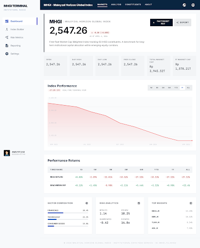
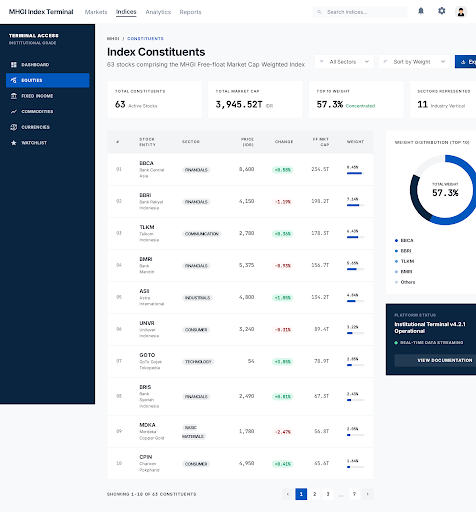

# Stitch UI Designs — MHGI

> Professional institutional-grade UI designs for the Maleyzal Horizon Global Index platform, generated with [Google Stitch](https://stitch.withgoogle.com/) using the **Horizon Quant** design system.

## Design System: Horizon Quant

Inspired by MSCI World Index, Vanguard Fund pages, and Bloomberg terminals.

| Token | Value | Usage |
|---|---|---|
| Primary | `#0A2540` | Navy — titles, sidebar, active states |
| Secondary | `#0058BE` | Interactive blue — CTAs, links |
| Tertiary | `#10B981` | Positive green — gains, success |
| Error | `#EF4444` | Negative red — losses, decline |
| Surface | `#F7F9FB` | Page background |
| Card | `#FFFFFF` | Content modules |
| Text | `#191C1E` | Primary text |
| Text Muted | `#43474D` | Labels, metadata |

### Typography
- **Headings**: Inter (Bold/SemiBold)
- **Data/Numbers**: JetBrains Mono (monospaced for financial alignment)
- **Body**: Inter (Regular)

### Design Principles
1. **Data-first layout** — numbers and charts are the hero
2. **No drop shadows** — depth via tonal layering only
3. **Sharp corners** (4px) — institutional precision
4. **No-line rule** — boundaries via background shifts, not borders
5. **Dual-font system** — narrative (Inter) vs. data (Mono)

## Screens

### 1. Dashboard (`dashboard.html`)


Main index overview with:
- Hero section with large index value and change indicator
- Key metrics row (Open, High, Low, Prev Close, Market Cap)
- Performance chart with timeframe selectors
- Performance returns table
- Sector composition breakdown
- Risk analytics panel
- Top weights sidebar

### 2. Constituents (`constituents.html`)


Stock constituents table with:
- Summary cards (Total, Market Cap, Top 10 Weight, Sectors)
- Filterable/searchable data table (63 stocks)
- Weight distribution donut chart
- Professional pagination

## Stitch Project

- **Project ID**: `15762293302419836131`
- **Design System**: `assets/adb7edb3fcc2494690b21cec5dd61971` (Horizon Quant)
- **Screen IDs**:
  - Dashboard: `42b5143295dc494cbb5c57be99acf237`
  - Constituents: `7e7154b5b2df44c5a7a0943cb7992532`

## Usage

Open any `.html` file directly in a browser to preview the design:
```bash
# Windows
start frontend/stitch-designs/dashboard.html

# Mac/Linux
open frontend/stitch-designs/dashboard.html
```

These designs serve as the target UI reference for implementing the React frontend.
